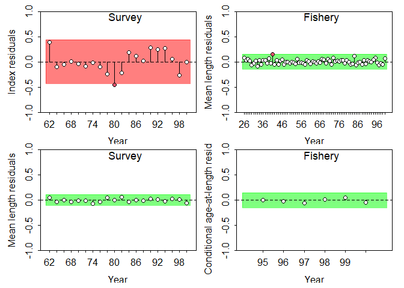
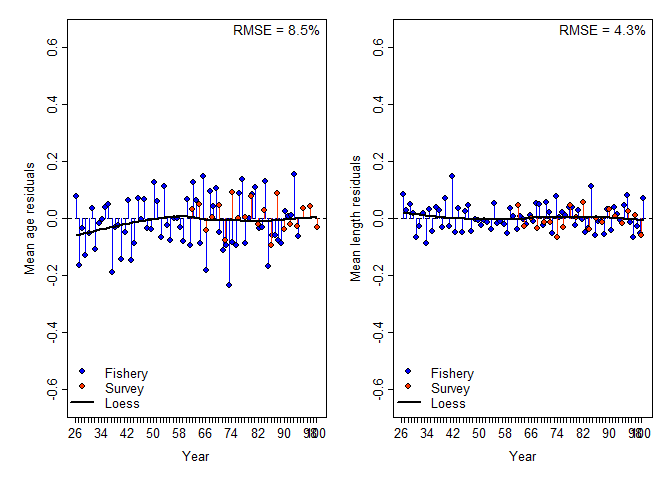
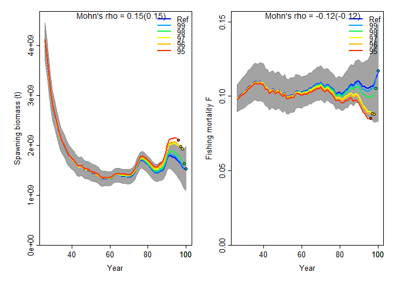
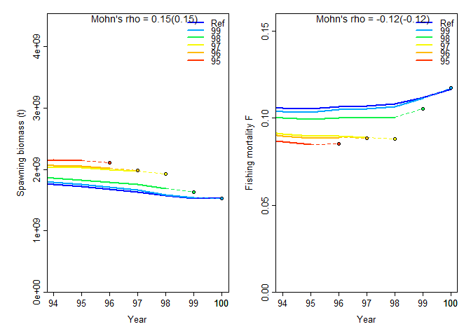

<!-- README.md is generated from README.Rmd. Please edit that file -->

# ss3diags

<!-- badges: start -->

[](https://github.com/PIFSCstockassessments/ss3diags/actions)
<!-- badges: end -->

*NOTE: This is the PIFSCstockasssessments fork of the main
[ss3diags](https://github.com/jabbamodel/ss3diags) repository.*

### Build Status

The R package `ss3diags` enables users to apply advanced diagnostics to
evaluate a Stock Synthesis model. Diagnostics include residual analyses,
hindcasting and cross-validation techniques, and retrospective analyses.
Functions also allow users to reproduce the key model diagnostics plots
that presented in the paper ‘A Cookbook for Using Model Diagnostics in
Integrated Stock Assessments’.

A handbook with detailed [User guidelines for Advanced Model Diagnostics
with
ss3diags](https://github.com/jabbamodel/ss3diags/blob/master/Vignette/ss3diags_handbook.pdf)
is currently being finalized.

In addition, the ss3diags Github respository provides fully commented
step-by-step R recipes on how to:

-   [Do log-likelood profiling for
    R0](/Cookbook/Likelihood_profile_R0_example.R)
-   [Run the ASPM diagnostic](/Cookbook/Setup_ASPM_example.R)
-   [Conduct iterative hindcasts for restrospective analysis with
    forecasts](/Cookbook/Run_Retrospective_example.R)
-   [Do Jitter tests](/Cookbook/Jitter_test_example.R)

with Stock Synthesis by making use of a comprehensive collection of R
functions available in the R package
[`r4ss`](https://github.com/r4ss/r4ss)

## Installation

ss3diags is not currently supported on CRAN. You can install the
development version of ss3diags from [GitHub](https://github.com/) with:

``` r
# install.packages("remotes")
remotes::install_github("PIFSCstockassessments/ss3diags")
```

Once the package is installed it can be loaded by:

``` r
library(ss3diags)
```

## Applying ss3diags for Model Diagnostics

#### Example Model

For demonstration purposes, a simple, cod-like SS model was simulated
using [ss3sim](https://github.com/ss3sim/ss3sim). The model includes 2
fleets, one fishery and one survey. Catch data is available from year 26
to year 100 (final year of model). An index of abundance is available
from the survey fleet for years 62 - 100. No discard data was simulated.
Simulated composition data includes length (fleets 1 and 2), age (fleets
1 and 2), and conditional age-at-length (fleet 1). The SS output for
this model can be loaded into the environment using

``` r
data("simple")
```

#### Residual Diagnostics

ss3diags provides 4 main functions to evaluate model misspecification:
`SSplotRunstest()` (and `SSrunstest()`), `SSplotJABBAres()`,
`SSplotRetro()`, and `SShcbias()`. A runs test is a test for randomness
and in the runstest functions, it is applied to the residuals from model
fits to abundance indices or composition data. Below, we show an example
of performing a runs test on the index, length composition, and
conditional age-at-length fits.

``` r
sspar(mfrow = c(2,2))
SSplotRunstest(simple, subplots = "cpue", add = TRUE)
#> Residual Runs Test (/w plot) stats by Index:
#>    Index runs.p   test  sigma3.lo sigma3.hi type
#> 1 Survey  0.033 Failed -0.4320694 0.4320694 cpue
SSplotRunstest(simple, subplots = "len", add = TRUE)
#> Residual Runs Test (/w plot) stats by Mean length:
#>     Index runs.p   test  sigma3.lo sigma3.hi type
#> 1 Fishery  0.724 Passed -0.1454301 0.1454301  len
#> 2  Survey  0.338 Passed -0.1105796 0.1105796  len
SSplotRunstest(simple, subplots = "con", add = TRUE)
#> Residual Runs Test (/w plot) stats by Conditional age-at-length:
#>     Index runs.p   test  sigma3.lo sigma3.hi type
#> 1 Fishery    0.5 Passed -0.1491212 0.1491212  con
```

 The
output for `SSplotRunstest()` includes a plot of the residuals by fleet
and a table with the results from the runs test and ‘three-sigma limit’
values. In the plots above, the shaded area represents the ‘three-sigma
limit’, or three residual standard deviations from zero. If any of the
individual residual points fall outside of the three-sigma limit, they
are colored red as in the fishery length-composition. Green shaded area
indicates the residuals are randomly distributed (p-value &gt;= 0.05)
and red shaded area indicates the residuals are not randomly distributed
and there is some misspecification with the indices or composition data
(p-value &lt; 0.05). In addition to the residual plots,
`SSplotRunstest()` produces a summary table of the runs test output
values, including:

-   p-value for the runs test  
-   if the test passed or failed (indicated by green or red shading in
    the plot)
-   upper and lower limits for the 3-sigma interval
-   type of data tested (cpue, length-composition, age-composition, or
    conditional age-at-length)

To only produce the summary table and skip the plot, use `SSrunstest()`.

The second function for residual diagnostics is the function
`SSplotJABBAres()`. This function is from the R package
[JABBA](https://github.com/jabbamodel/JABBA) and plots a timeseries of
residuals for all fleets of the indicated data (cpue or composition). In
the example below, we plot the residuals for the mean age
(age-composition) and mean length (length-composition) for both fleets.

``` r
sspar(mfrow=c(1,2),plot.cex=0.8)
SSplotJABBAres(simple, subplots = "age", add = TRUE)
#> RMSE stats by Index:
#>    indices RMSE.perc nobs
#> 1  Fishery       9.3   69
#> 2   Survey       5.1   20
#> 3 Combined       8.5   89
SSplotJABBAres(simple, subplots = "len", add = TRUE)
#> RMSE stats by Index:
#>    indices RMSE.perc nobs
#> 1  Fishery       4.5   75
#> 2   Survey       3.4   20
#> 3 Combined       4.3   95
```



The plots above show the residuals for both fishery and survey length
and age-composition data for each year, and the black line is a LOESS
smoother fit to all of the residuals. When data from multiple fleets are
avaialble in a year, a boxplot is displayed to show the median and
quantiles for that year. Additionally, the root-mean squared error is
reported in the top right-hand corner to indicate how well the model
fits the data (lower RMSE indicates better fit).

#### Retrospective and Forecast Bias

Retrospective analysis is commonly used to check the consistency of
model estimates such as spawning stock biomass (SSB) and fishing
mortality (F) as the model is updated with new data in retrospect. The
retrospective analysis involves sequentially removing observations from
the terminal year (i.e., peels), fitting the model to the truncated
series, and then comparing the relative difference between model
estimates from the full-time series with the truncated time-series.
Steps to conduct a retrospective analysis with a Stock Synthesis model
are documented [here](/Cookbook/Run_Retrospective_example.R). An example
of a retrospective analysis can be loaded in for use and summarized by

Note that `SSsummarize()` summarises the modelled quantities and
abundance indices but not composition data. To plot the output from the
retrospective analysis you can use the function

``` r
sspar(mfrow=c(1,2),plot.cex=0.8)
SSplotRetro(sumSimple, subplots = "SSB", add = TRUE)
#> Mohn's Rho stats, including one step ahead forecasts:
#>   type     peel         Rho  ForecastRho
#> 1  SSB       99 0.007769174 -0.006152424
#> 2  SSB       98 0.075590953  0.069386314
#> 3  SSB       97 0.207121898  0.229780185
#> 4  SSB       96 0.202493492  0.211816848
#> 5  SSB       95 0.245173711  0.254376716
#> 6  SSB Combined 0.147629846  0.151841528
SSplotRetro(sumSimple, subplots = "F", add = TRUE)
#> Mohn's Rho stats, including one step ahead forecasts:
#>   type     peel         Rho  ForecastRho
#> 1    F       99 -0.00509569  0.006707778
#> 2    F       98 -0.06829083 -0.057673536
#> 3    F       97 -0.17225678 -0.184649147
#> 4    F       96 -0.16735016 -0.175990996
#> 5    F       95 -0.19535279 -0.199995306
#> 6    F Combined -0.12166925 -0.122320241
```



Retrospective analysis is useful to evaluate how consistent the modeled
quantities are in retrospect. However, providing fisheries management
advice requires predicting a stock’s response to management and checking
that predictions are consistent when updated by new data in the future.
A first, intuitive extension of the retrospective analysis is to assess
potential forecast bias by adding the additional step of forward
projecting quantities, such as SSB, over the truncated years. This can
be visualized by adding `forecast = TRUE` in the function above.

``` r
sspar(mfrow=c(1,2),plot.cex=0.8)
SSplotRetro(sumSimple, subplots = "SSB", forecast = TRUE, add = TRUE, xlim = c(94,100), uncertainty = FALSE)
#> Mohn's Rho stats, including one step ahead forecasts:
#>   type     peel         Rho  ForecastRho
#> 1  SSB       99 0.007769174 -0.006152424
#> 2  SSB       98 0.075590953  0.069386314
#> 3  SSB       97 0.207121898  0.229780185
#> 4  SSB       96 0.202493492  0.211816848
#> 5  SSB       95 0.245173711  0.254376716
#> 6  SSB Combined 0.147629846  0.151841528
SSplotRetro(sumSimple, subplots = "F", forecast = TRUE, add = TRUE, xlim = c(94,100), uncertainty = FALSE, ylim = c(0,0.16))
#> Mohn's Rho stats, including one step ahead forecasts:
#>   type     peel         Rho  ForecastRho
#> 1    F       99 -0.00509569  0.006707778
#> 2    F       98 -0.06829083 -0.057673536
#> 3    F       97 -0.17225678 -0.184649147
#> 4    F       96 -0.16735016 -0.175990996
#> 5    F       95 -0.19535279 -0.199995306
#> 6    F Combined -0.12166925 -0.122320241
# Note xlim and ylim were adjusted manually and uncertainty intervals were removed to better display the forecasted estimates
```



In addition to the retrospective plots, a summary statistics table can
be produced using `SShcbias()`. This table includes \* type of estimate
(SSB or F) \* the year removed or “peel” \* mohn’s rho \* forecast bias

by year and overall (“Combined”). Mohn’s rho is a measure of the
severity of bias in the retrospective patterns and the forecast bias is
an estimate of bias in the forecasted quantities when years of data were
removed.

#### Further Diagnostics

For more advanced model diagnostics we provide the functions
`SSplotHCxval()` and `SSmase()` for evaluating hindcast cross-validation
and prediction skill. To evaluate model uncertainty, we provide the
functions `SSdeltaMVLN()`, `SSplotEnsemble()`, and `SSplotKobe()`.

## Contributing to ss3diags

If you would like to contribute to ss3diags or have suggestions for
diagnostic tests to include in the package, you can submit a new
[issue](https://github.com/PIFSCstockassessments/ss3diags/issues).

## Reference

To cite ss3diags for a publication you can use

``` r
citation("ss3diags")
#> 
#> To cite ss3diags in publications use:
#> 
#>   Carvalho, F., Winker, H., Courtney, D., Kapur, M., Kell, L.,
#>   Cardinale, M., Schirripag, M., Kitakado, T., Yemane, D., Piner, K.R.,
#>   Maunder, M.N., Taylor, I., Wetzel, C.R., Doering, K., Johnsonm, K.F.,
#>   Methot, R.D. 2021. A cookbook for using model diagnostics in
#>   integrated stock assessments. Fisheries Research. 240, 1-18.
#>   https://doi.org/10.1016/j.fishres.2021.105959.
#> 
#> A BibTeX entry for LaTeX users is
#> 
#>   @Article{,
#>     title = {A cookbook for using model diagnostics in integrated stock assessments},
#>     author = {Felipe Carvalho and Henning Winker and Dean Courtney and Maia Kapur and Laurence Kell and Massimiliano Cardinale and Michael Schirripa and Toshihide Kitakado and Dawit Yemane and Kevin R. Piner and Mark N. Maunder and Ian Taylor and Chantel R. Wetzel and Kathryn Doering and Kelli F. Johnson and Richard D. Methot},
#>     journal = {Fisheries Research},
#>     year = {2021},
#>     volume = {240},
#>     pages = {105959},
#>     url = {https://www.sciencedirect.com/science/article/pii/S0165783621000874},
#>     issn = {0165-7836},
#>     doi = {https://doi.org/10.1016/j.fishres.2021.105959},
#>   }
```

## Disclaimer

The United States Department of Commerce (DOC) GitHub project code is
provided on an ‘as is’ basis and the user assumes responsibility for its
use. DOC has relinquished control of the information and no longer has
responsibility to protect the integrity, confidentiality, or
availability of the information. Any claims against the Department of
Commerce stemming from the use of its GitHub project will be governed by
all applicable Federal law. Any reference to specific commercial
products, processes, or services by service mark, trademark,
manufacturer, or otherwise, does not constitute or imply their
endorsement, recommendation or favoring by the Department of Commerce.
The Department of Commerce seal and logo, or the seal and logo of a DOC
bureau, shall not be used in any manner to imply endorsement of any
commercial product or activity by DOC or the United States Government.”

<!-- What is special about using `README.Rmd` instead of just `README.md`? You can include R chunks

You'll still need to render `README.Rmd` regularly, to keep `README.md` up-to-date. `devtools::build_readme()` is handy for this. You could also use GitHub Actions to re-render `README.Rmd` every time you push. An example workflow can be found here: <https://github.com/r-lib/actions/tree/v1/examples>.

In that case, don't forget to commit and push the resulting figure files, so they display on GitHub and CRAN.-->
