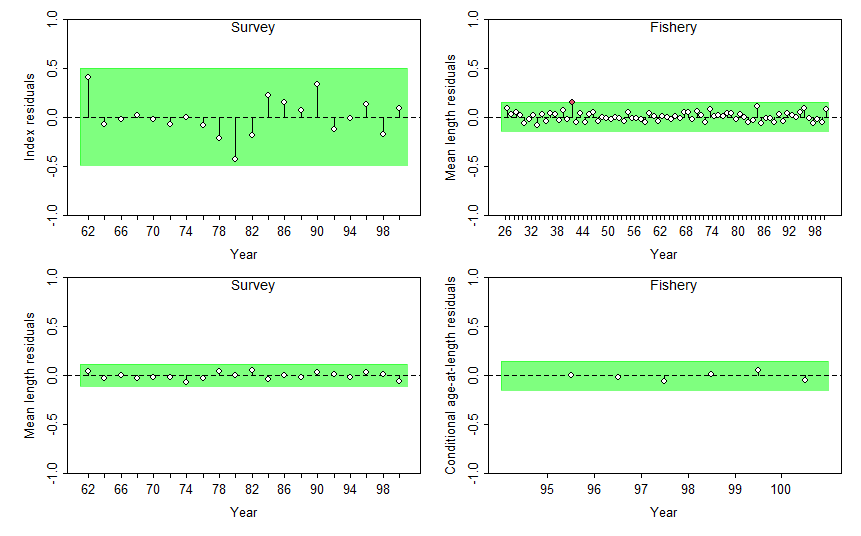
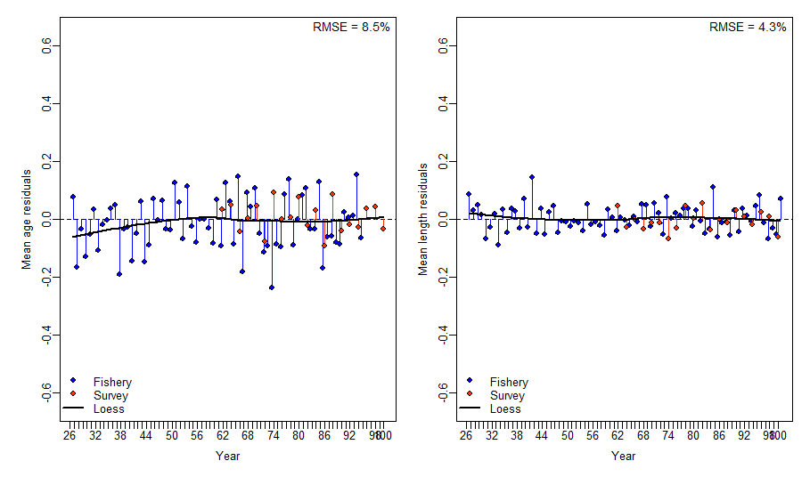
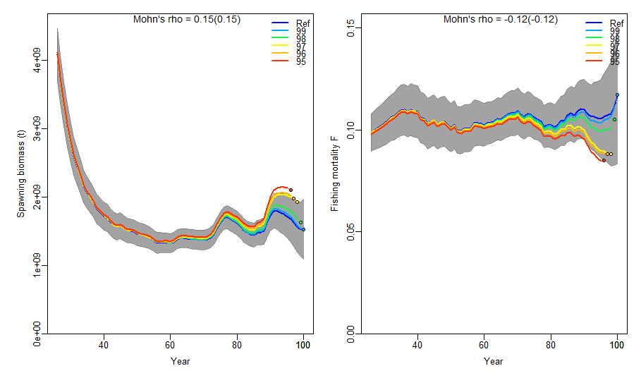
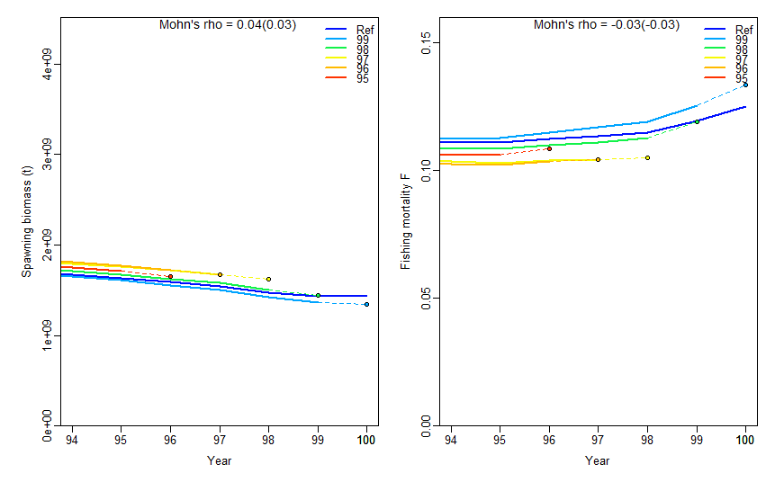

# ss3diags

### Build Status

[](https://github.com/PIFSCstockassessments/ss3diags/actions)

The R package `ss3diags` enables users to apply advanced diagnostics to evaluate a Stock Synthesis model. Diagnostics include residual analyses, hindcasting and cross-validation techniques, and retrospective analyses. Functions also allow users to reproduce the key model diagnostics plots that presented in the paper 'A Cookbook for Using Model Diagnostics in Integrated Stock Assessments'. 

A handbook with detailed [User guidelines for Advanced Model Diagnostics with ss3diags](https://github.com/jabbamodel/ss3diags/blob/master/Vignette/ss3diags_handbook.pdf) is currently being finalized. 


In addition, the ss3diags Github respository provides fully commented step-by-step R recipes on how to:  

- [Do log-likelood  profiling for R0](/Cookbook/Likelihood_profile_R0_example.R)
- [Run the ASPM diagnostic](/Cookbook/Setup_ASPM_example.R)
- [Conduct iterative hindcasts for restrospective analysis with forecasts](/Cookbook/Run_Retrospective_example.R)
- [Do Jitter tests](/Cookbook/Jitter_test_example.R)

with Stock Synthesis by making use of a comprehensive collection of R functions available in the R package [`r4ss`](https://github.com/r4ss/r4ss)

## Installation 

ss3diags is not currently supported on CRAN. To install `ss3diags` directly from the GitHub repository install an R version >= 3.5 and then: 
```S
install.packages("devtools")
library(devtools)
install_github("JABBAmodel/ss3diags") #should this be switched to PIFSC repo?
```
Once the package is installed it can be loaded by:
```S
library(ss3diags)
```
## Applying ss3diags for Model Diagnostics 
#### Example Model  
For demonstration purposes, a simple, cod-like SS model was simulated using [ss3sim](https://github.com/ss3sim/ss3sim). The model includes 2 fleets, one fishery and one survey. Catch data is available from year 26 to year 100 (final year of model). An index of abundance is available from the survey fleet for years 62 - 100. No discard data was simulated. Simulated composition data includes length (fleets 1 and 2), age (fleets 1 and 2), and conditional age-at-length (fleet 1). The SS output for this model can be loaded into the environment using 
```S
data("diags_simple")
```

#### Residual Diagnostics
ss3diags provides 4 main functions to evaluate model misspecification: `SSplotRunstest()` (and `SSrunstest()`), `SSplotJABBAres()`, `SSplotRetro()`, and `SShcbias()`. A runs test is a test for randomness and in the runstest functions, it is applied to the residuals from model fits to abundance indices or composition data. Below, we show an example of performing a runs test on the index, length composition, and conditional age-at-length fits. 
```S
sspar(mfrow = c(2,2))
SSplotRunstest(simple, subplots = "cpue", add = TRUE)
SSplotRunstest(simple, subplots = "len", add = TRUE)
SSplotRunstest(simple, subplots = "con", add = TRUE)
```
 

The output for `SSplotRunstest()` includes a plot of the residuals by fleet and a table with the results from the runs test and 'three-sigma limit' values. In the plots above, the shaded area  represents the 'three-sigma limit', or three residual standard deviations from zero. If any of the individual residual points fall outside of the three-sigma limit, they are colored red as in the fishery length-composition. Green shaded area indicates the residuals are randomly distributed (p-value >= 0.05) and red shaded area indicates the residuals are not randomly distributed and there is some misspecification with the indices or composition data (p-value < 0.05>). In addition to the residual plots, `SSplotRunstest()` produces a summary table of the runs test output values, including: 

  * p-value for the runs test  
  * if the test passed or failed (indicated by green or red shading in the plot)
  * upper and lower limits for the 3-sigma interval 
  * type of data tested (cpue, length-composition, age-composition, or conditional age-at-length)
  
To only produce the summary table and skip the plot, use `SSrunstest()`. 

The second function for residual diagnostics is the function `SSplotJABBAres()`. This function is from the R package [JABBA](https://github.com/jabbamodel/JABBA) and plots a timeseries of residuals for all fleets of the indicated data (cpue or composition). In the example below, we plot the residuals for the mean age (age-composition) and mean length (length-composition) for both fleets. 
```S
sspar(mfrow=c(1,2),plot.cex=0.8)
SSplotJABBAres(simple, subplots = "age", add = TRUE)
SSplotJABBAres(simple, subplots = "len", add = TRUE)
```


The plots above show the residuals for both fishery and survey length and age-composition data for each year, and the black line is a LOESS smoother fit to all of the residuals. When data from multiple fleets are avaialble in a year, a boxplot is displayed to show the median and quantiles for that year. Additionally, the root-mean squared error is reported in the top right-hand corner to indicate how well the model fits the data (lower RMSE indicates better fit).

#### Retrospective and Forecast Bias  
Retrospective analysis is commonly used to check the consistency of model estimates such as spawning stock biomass (SSB) and fishing mortality (F) as the model is updated with new data in retrospect. The retrospective analysis involves sequentially removing observations from the terminal year (i.e., peels), fitting the model to the truncated series, and then comparing the relative difference between model estimates from the full-time series with the truncated time-series. Steps to conduct a retrospective analysis with a Stock Synthesis model are documented [here](/Cookbook/Run_Retrospective_example.R). An example of a retrospective analysis can be loaded in for use and summarized by 
```S
data("retro_simple")
sumSimple <- r4ss::SSsummarize(retroSimple)
```
Note that `SSsummarize()` summarises the modelled quantities and abundance indices but not composition data. To plot the output from the retrospective analysis you can use the function 
```S
sspar(mfrow=c(1,2),plot.cex=0.8)
SSplotRetro(sumSimple, subplots = "SSB", add = TRUE)
SSplotRetro(sumSimple, subplots = "F", add = TRUE)
```


Retrospective analysis is useful to evaluate how consistent the modeled quantities are in retrospect. However, providing fisheries management advice requires predicting a stock’s response to management and checking that predictions are consistent when updated by new data in the future. A first, intuitive extension of the retrospective analysis is to assess potential forecast bias by adding the additional step of forward projecting quantities, such as SSB, over the truncated years. This can be visualized by adding `forecast = TRUE` in the function above. 
```S
sspar(mfrow=c(1,2),plot.cex=0.8)
SSplotRetro(sumSimple, subplots = "SSB", forecast = TRUE, add = TRUE, xlim = c(94,100), uncertainty = FALSE)
SSplotRetro(sumSimple, subplots = "F", forecast = TRUE, add = TRUE, xlim = c(94,100), uncertainty = FALSE, ylim = c(0,0.16))
# Note xlim and ylim were adjusted manually and uncertainty intervals were removed to better display the forecasted estimates
```


In addition to the retrospective plots, a summary statistics table can be produced using `SShcbias()`. This table includes 
  * type of estimate (SSB or F)
  * the year removed or "peel"
  * mohn's rho 
  * forecast bias 

by year and overall ("Combined"). Mohn's rho is a measure of the severity of bias in the retrospective patterns and the forecast bias is an estimate of bias in the forecasted quantities when years of data were removed. 

#### Further Diagnostics  
For more advanced model diagnostics we provide the functions `SSplotHCxval()` and `SSmase()` for evaluating hindcast cross-validation and prediction skill. To evaluate model uncertainty, we provide the functions `SSdeltaMVLN()`, `SSplotEnsemble()`, and `SSplotKobe()`.


## Contributing to ss3diags  
If you would like to contribute to ss3diags or have suggestions for diagnostic tests to include in the package, you can submit a new [issue](https://github.com/PIFSCstockassessments/ss3diags/issues).

## Reference
To cite ss3diags for a publication you can use 
```S
citation("ss3diags")
```

Carvalho, F., Winker, H., Courtney, D., Kapur, M., Kell, L., Cardinale, M., Schirripag, M., Kitakado, T., Yemane, D., Piner, K.R., Maunder, M.N., Taylor, I., Wetzel, C.R., Doering, K., Johnsonm, K.F., Methot, R.D., in press. A Cookbook for Using Model Diagnostics in Integrated Stock Assessments. Fisheries Research.


